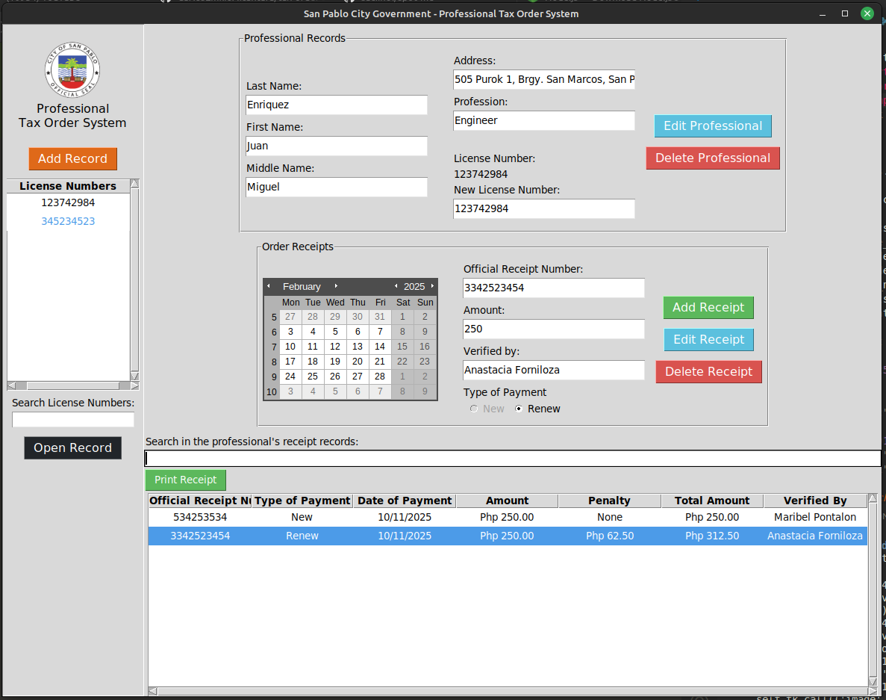
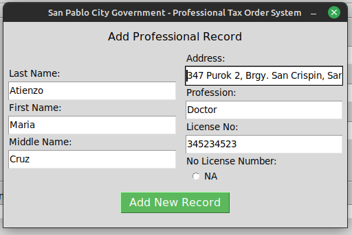
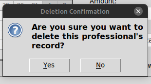
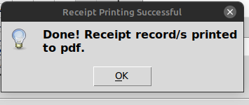

# BTD - Professional Tax Order System 🧾
A **tax order system** for recording the tax orders of professionals in the city of San Pablo.

---

## 🧠 Features

- Modular and scalable codebase
- Automatic document writing as PDF

---

## 🔧 Tech Stack

- **Frontend**: Tkinter
- **Backend**: Python
- **Database**: SQLite
- **PDF Creation**: PyFPDF

---

## 📸 Screenshots






---

## 🚀 How to Run Locally                                                                                              

1. **Clone the repository:**
   ```bash                                                                                                            
   git clone https://github.com/CarlosEmilioAlcantara/tax-order-system.git
   cd tax-order-system

2. **Create a virtual environment and install dependencies**

   Linux
   ```bash
   mkdir venv
   python3 -m venv venv 
   source venv/bin/activate
   pip install -r requirements.txt
 

   Windows
   ```bash
   mkdir venv
   python -m venv venv 
   .\venv\Scripts\activate
   pip install -r requirements.txt
 
3. **Run the app**                                                                                                    

   Linux
   ```bash
   python3 tax_order_system-v4.py

   Windows
   ```bash
   python tax_order_system-v4.py
